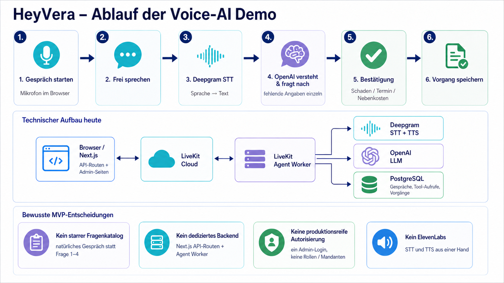

# HeyVera

HeyVera ist eine deutschsprachige Voice-AI-Demo für die strukturierte Aufnahme von Anliegen in der Immobilienverwaltung. Nutzer sprechen frei mit Vera; die Anwendung erkennt das Anliegen, fragt fehlende Angaben einzeln ab und speichert den Vorgang erst nach einer ausdrücklichen Bestätigung.

Unterstützt werden aktuell:

- Schadensmeldungen, beispielsweise Heizung, Wasser oder Elektrik
- Terminwünsche
- Nebenkostenanfragen

Das Ziel des MVP ist nicht, eine vollständige Hausverwaltungssoftware zu ersetzen. Die Demo zeigt, wie ein natürliches Sprachgespräch zuverlässig in einen bestätigten, strukturierten und nachvollziehbaren Vorgang überführt werden kann.

## Ablauf



1. Der Browser startet eine kurzlebige LiveKit-Session und überträgt das Mikrofon-Audio.
2. Deepgram Flux wandelt die Sprache in Text um (STT).
3. OpenAI versteht das Anliegen und steuert den Dialog. Bereits genannte Informationen werden übernommen und nur fehlende Pflichtangaben einzeln abgefragt.
4. Vera fasst den vollständigen Vorgang zusammen und wartet auf die ausdrückliche Bestätigung des Nutzers.
5. Der Agent speichert die bestätigte Meldung über `create_damage_report` oder `create_service_request` in PostgreSQL.
6. Deepgram Aura-2 wandelt Veras Antwort wieder in Sprache um (TTS); LiveKit überträgt sie zurück zum Browser.

LiveKit übernimmt dabei den Echtzeittransport und die Agent-Orchestrierung. STT und TTS laufen direkt über Deepgram Cloud, das LLM direkt über die OpenAI Responses API.

## Bewusste MVP-Grenzen

- Kein starrer Fragenkatalog: Das Gespräch ist frei; strukturiert wird das Ergebnis.
- Kein separates REST-Backend: Next.js API-Routen und der langlebige Agent Worker übernehmen die serverseitigen Aufgaben.
- Keine produktionsreife Benutzerverwaltung: Es gibt einen gemeinsamen Admin-Login, aber keine Rollen, Mandanten, MFA oder SSO.
- Kein ElevenLabs: Deepgram deckt für den MVP sowohl STT als auch TTS ab.
- Keine automatische Weiterleitung oder Bearbeitung: Ein gespeicherter Vorgang wird lediglich aufgenommen.
- Keine Notruffunktion: Bei akuter Gefahr verweist Vera auf den Notruf 112; eine Meldung ersetzt keinen Notruf.

## Projektstruktur

```text
apps/
├── web/       Next.js-Oberfläche, Admin-Bereich und Voice-Session-Endpunkte
└── agent/     LiveKit Agent Worker, Voice-Pipeline und fachliche Tools

packages/
├── config/    Validierung der Umgebungs- und Runtime-Konfiguration
├── core/      Fachliche Schemas, Services, Prompt- und Sicherheitsregeln
└── db/        Drizzle-Schema, PostgreSQL-Repositories und Migrationen
```

## Tech-Stack

| Bereich | Technologie | Aufgabe |
| --- | --- | --- |
| Sprache | TypeScript 5.9, Node.js 22+ | Gemeinsame Laufzeit für Web, Agent und Packages |
| Monorepo | pnpm 11, Turborepo 2.10 | Workspaces, Builds und parallele Tasks |
| Web | Next.js 16, React 19 | UI, Admin-Seiten und serverseitige API-Routen |
| Echtzeit-Audio | LiveKit Client/Server SDK, LiveKit Agents 1.6 | Rooms, Audio-Transport und Agent-Orchestrierung |
| Speech-to-Text | Deepgram Flux | Deutsches Streaming-STT und Turn-Erkennung |
| LLM | OpenAI Responses API, standardmäßig `gpt-4.1` | Dialogsteuerung, Tool-Auswahl und Antworten |
| Text-to-Speech | Deepgram Aura-2 | Deutsche Sprachausgabe mit Fallback-Stimme |
| Datenbank | PostgreSQL 17 | Gespräche, Nachrichten, Tool-Aufrufe und Vorgänge |
| Datenzugriff | Drizzle ORM 0.45, `postgres` 3.4 | Schema, Migrationen und transaktionale Repositories |
| Validierung | Zod 4.4 | Runtime-Konfiguration und fachliche Eingaben |
| Betrieb | Docker, Docker Compose | Lokale Datenbank oder kompletter Service-Stack |
| Qualität | Node Test Runner, Playwright, Biome | Unit-/Integrationstests, E2E, Formatierung und Linting |

## Voraussetzungen

- Node.js 22 oder neuer
- pnpm 11
- Docker mit Docker Compose
- ein LiveKit-Cloud-Projekt
- API-Zugänge für Deepgram und OpenAI

## Konfiguration

Abhängigkeiten installieren und die lokale Konfiguration anlegen:

```sh
pnpm install
cp .env.example .env.local
```

In `.env.local` müssen mindestens folgende Werte gesetzt werden:

```dotenv
APP_URL=http://localhost:3000
LIVEKIT_URL=wss://<livekit-projekt>.livekit.cloud
LIVEKIT_API_KEY=<livekit-api-key>
LIVEKIT_API_SECRET=<livekit-api-secret>
DEEPGRAM_API_KEY=<deepgram-api-key>
OPENAI_API_KEY=<openai-api-key>
POSTGRES_PASSWORD=<lokales-datenbankpasswort>
SESSION_SECRET=<mindestens-32-zufällige-zeichen>
ADMIN_USERNAME=admin
ADMIN_PASSWORD_HASH=<scrypt-hash>
```

Den Admin-Passworthash erzeugen:

```sh
pnpm auth:hash '<admin-passwort>'
```

Die Ausgabe als `ADMIN_PASSWORD_HASH` eintragen. API-Keys, Passwörter und Hashes dürfen nicht committed werden.

## Lokal starten

### Variante A: Web und Agent auf dem Host

Diese Variante eignet sich am besten für die Entwicklung mit Hot Reload.

In `.env.local` muss die Datenbank über den lokal veröffentlichten Port erreichbar sein:

```dotenv
DATABASE_URL=postgresql://heyvera:<POSTGRES_PASSWORD>@localhost:5433/heyvera
```

PostgreSQL starten und die Migrationen ausführen:

```sh
./scripts/compose-local.sh up -d postgres migrate
```

Danach Web-App und Agent gemeinsam starten:

```sh
pnpm dev
```

Anwendung öffnen:

- Login: <http://localhost:3000/login>
- Voice-Demo: <http://localhost:3000>
- gespeicherte Vorgänge: <http://localhost:3000/requests>
- Gesprächsverlauf: <http://localhost:3000/conversations>
- Vera konfigurieren: <http://localhost:3000/settings>

Beim ersten Gespräch muss der Browserzugriff auf das Mikrofon erlaubt werden.

### Variante B: Vollständig mit Docker Compose

Für diese Variante sollte die Datenbank-URL in `.env.local` auf den Compose-Service zeigen:

```dotenv
DATABASE_URL=postgresql://heyvera:<POSTGRES_PASSWORD>@postgres:5432/heyvera
```

Den vollständigen Stack bauen und starten:

```sh
./scripts/compose-local.sh up --build
```

Gestartet werden `web`, `agent`, `postgres` und der einmalige Migrationsjob. Die Web-App ist anschließend unter <http://localhost:3000> erreichbar.

Stack beenden:

```sh
./scripts/compose-local.sh down
```

## Ohne Provider testen

Die Oberfläche kann ohne echte Voice-Provider mit einem deterministischen Fake-Transport geprüft werden:

```sh
pnpm dev:web
```

<http://localhost:3000/?voiceTransport=fake>

Login, Web-App und PostgreSQL werden dafür weiterhin benötigt; lediglich die echte LiveKit-/Deepgram-/OpenAI-Voice-Pipeline wird umgangen.

## Demo-Daten

Nach ausgeführter Migration können zwei reproduzierbare Beispielgespräche angelegt werden:

```sh
pnpm db:seed
```

Nur diese Demo-Daten wieder entfernen:

```sh
pnpm db:reset-demo
```

## Qualitätsprüfung

```sh
pnpm quality
pnpm test
pnpm build
```

Der ausführliche manuelle Demo- und Provider-Smoke-Test steht in [docs/RELEASE_CHECKLIST.md](docs/RELEASE_CHECKLIST.md).
